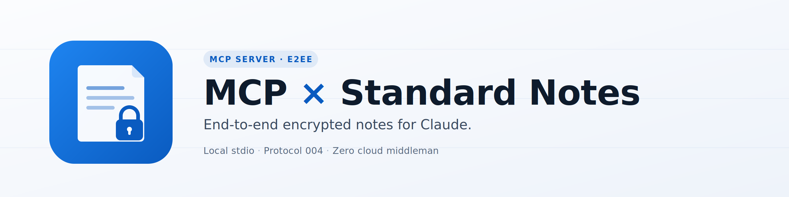

<p align="center">
  
</p>

# mcp-standardnotes

[](https://github.com/lozit/mcp-standardnotes/actions/workflows/ci.yml)
[](./LICENSE)
[](#requirements)

**Give Claude secure read/write access to your [Standard Notes](https://standardnotes.com/) vault — end-to-end encrypted, local stdio only, zero cloud middleman.**

Ask Claude to summarize your notes, draft new ones, organize tags, search across your vault — all while your master key stays on your machine. Works with Claude Code, Claude Desktop, and any MCP-compatible client.

> **Disclaimer.** This is an unofficial third-party integration. Not affiliated with, endorsed by, or sponsored by Standard Notes Ltd. "Standard Notes" is a trademark of Standard Notes Ltd.

## Why

- 🔒 **End-to-end encrypted.** All decryption happens locally using audited libsodium primitives (Argon2id + XChaCha20-Poly1305 IETF). Your password never leaves RAM; your master key never leaves your machine.
- 🔌 **Local stdio only.** No network port is ever opened by this server.
- 🔑 **OS keychain for session storage.** macOS Keychain, Linux libsecret, Windows Credential Vault — never plaintext files.
- ☁️ **Works with the official cloud or self-hosted** Standard Notes servers.

## Features

| Tool | What it does |
|------|---|
| `notes_list` / `notes_search` / `notes_get` | Browse and search your notes (filter by tag with `tag: "<uuid-or-title>"`) |
| `notes_create` / `notes_update` / `notes_delete` | Write notes (markdown, super, code, rich-text, task, spreadsheet, plain-text) |
| `notes_create_many` | Batch-create up to 50 notes in one sync push |
| `notes_stats` | Vault stats: counts, sizes, oldest/newest/largest note |
| `tags_list` / `tags_get` / `tags_create` / `tags_update` / `tags_delete` | Full tag CRUD |
| `tags_attach` / `tags_detach` | Link/unlink tags to notes |
| `sync` | Force a sync with the server |

`notes_create` and `notes_update` accept an optional `tags: string[]` (tag UUIDs) to link tags at write time.

## Requirements

- **Node.js ≥ 20**
- A Standard Notes account on **protocol 004** (default for any account created or upgraded since 2020)
- macOS, Linux, or Windows with a working OS keychain

## Quickstart

### 1. Install

```bash
npm install -g mcp-standardnotes
```

Or run from a clone if you prefer:

```bash
git clone https://github.com/lozit/mcp-standardnotes.git
cd mcp-standardnotes
npm install && npm run build
```

### 2. Log in once

```bash
mcp-standardnotes-login         # if installed globally
# or, from a clone:
npm run login
```

You'll be prompted for email and password. The password derives your master key in memory (Argon2id) and is never written to disk. An encrypted session is stored in your OS keychain; subsequent runs reuse it automatically.

### 3. Hook it up to Claude

**Claude Code** — add to `~/.claude.json` or `.mcp.json`:

```json
{
  "mcpServers": {
    "mcp-standardnotes": {
      "type": "stdio",
      "command": "mcp-standardnotes",
      "env": { "SN_EMAIL": "you@example.com" }
    }
  }
}
```

If you cloned instead of `npm install -g`, replace `command` with the absolute path to `node` and add `args: ["/absolute/path/to/mcp-standardnotes/dist/index.js"]`.

Then `/mcp` to reconnect.

**Claude Desktop (macOS)** — edit `~/Library/Application Support/Claude/claude_desktop_config.json` with the same structure, and use an **absolute path** to your Node ≥ 20 binary (Claude Desktop does not inherit `nvm`). See [docs/troubleshooting.md](./docs/troubleshooting.md) if you hit `SyntaxError: Unexpected token '??='`.

**Any other MCP client** — run `node dist/index.js` with `SN_EMAIL` set in the environment. Transport is stdio.

**Self-hosting Standard Notes?** See [docs/self-hosted.md](./docs/self-hosted.md) for the docker-compose recipe and how to pin your TLS certificate.

## Configuration

| Variable | Default | Description |
|---|---|---|
| `SN_EMAIL` | *required* | Your SN account email. Must match what you used with `npm run login`. |
| `SN_SERVER_URL` | `https://api.standardnotes.com` | Sync server URL. Change for self-hosted instances. |
| `KEYCHAIN_SERVICE` | `mcp-standardnotes` | Override the keychain service name (useful for multiple accounts). |
| `SN_CERT_FINGERPRINT` | *unset* | SHA-256 TLS cert pin for self-hosted servers (64 hex chars, colons optional). See [docs/self-hosted.md](./docs/self-hosted.md). |

## Security at a glance

- Password in RAM only during key derivation. Never logged, never stored.
- Session + master key hex → OS keychain only. Never plaintext files.
- stdio transport only. No HTTP port, ever.
- All logs go to stderr, routed through a redactor that masks passwords, keys, JWTs, and token-like strings.
- All tool inputs validated by zod.
- `npm audit` HIGH/CRITICAL is a merge blocker in CI.
- Only the protocol 004 *framing* is implemented locally; all cryptographic primitives come from `libsodium-wrappers-sumo`.

Full threat model and deep-dive: [docs/protocol-004.md](./docs/protocol-004.md).

## Troubleshooting

Common issues and fixes: [docs/troubleshooting.md](./docs/troubleshooting.md).

## Logout

```bash
SN_EMAIL=you@example.com mcp-standardnotes-logout
# or, from a clone:
SN_EMAIL=you@example.com npm run logout
```

## Roadmap

Upcoming work tracked in [ROADMAP.md](./ROADMAP.md).

## Contributing

Contributions welcome. See [CONTRIBUTING.md](./CONTRIBUTING.md) for setup, tests, and PR checklist.

## License

[MIT](./LICENSE) — use it, fork it, ship it.

## Credits

- [Standard Notes](https://standardnotes.com/) for the encryption design and public API.
- [Model Context Protocol](https://modelcontextprotocol.io) and [Anthropic](https://www.anthropic.com) for the MCP SDK.
- [libsodium](https://doc.libsodium.org/) by Frank Denis, exposed via [libsodium-wrappers-sumo](https://github.com/jedisct1/libsodium.js).
